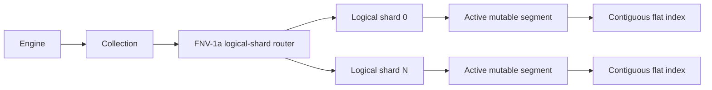

# Phase 1 architecture

**Maturity:** Experimental

The implemented ownership chain is:

## Responsibilities

- `internal/core`: dependency-free domain types and errors.
- `internal/distance`: portable cosine, dot and squared-L2 kernels.
- `internal/index`: pluggable vector-index contract.
- `internal/index/flat`: exact scan using row-major contiguous vectors and a
  bounded top-k heap.
- `internal/index/hnsw`: experimental hierarchical ANN graph with deterministic
  levels, bounded neighbor lists and recall tests against flat search.
- `internal/segment`: record-to-ordinal map and active local index.
- `internal/shard`: stable logical ownership boundary.
- `internal/collection`: deterministic routing and cross-shard top-k merge.
- `internal/storage`: temporary atomic JSON collection-catalog codec.
- `internal/wal`: checksummed per-shard write-ahead logs and recovery.
- `internal/engine`: collection catalog, mutation serialization and WAL order.
- `internal/api/rest`: bounded versioned HTTP surface.

Record routing hashes `namespace || 0x00 || ID` with FNV-1a and takes modulo the
immutable shard count. FNV-1a is used for the current implementation because it
is in the standard library and stable. The accepted technical design proposes
freezing a faster hash and canonical encoding before format compatibility; that
change will require an ADR and migration because routing compatibility matters.

## Concurrency

Flat-index search uses a read lock; mutation uses a write lock. The engine
currently serializes mutations globally so WAL append and in-memory visibility
retain a simple order. Searches proceed concurrently with other searches and
take shorter locks at segment level. This deliberately simple model is correct
but not a throughput claim; per-shard mutation serialization arrives with
immutable segment ownership and checkpointing.

## Persistence and failure behavior

Collection creation writes a same-directory temporary JSON catalog, fsyncs,
renames, and fsyncs its directory. Mutation validates and versions a record,
appends it to the routed shard WAL, applies configured WAL sync semantics, and
only then updates the in-memory segment. Startup loads the catalog and replays
all shard WALs. Startup fails rather than skipping an unreadable catalog or a
corrupt complete WAL record.

The JSON catalog and WAL format remain experimental. Immutable segments,
manifests, checkpoints, compaction, bounded WAL retention, batch group commit,
and stable format compatibility are not yet claimed.
