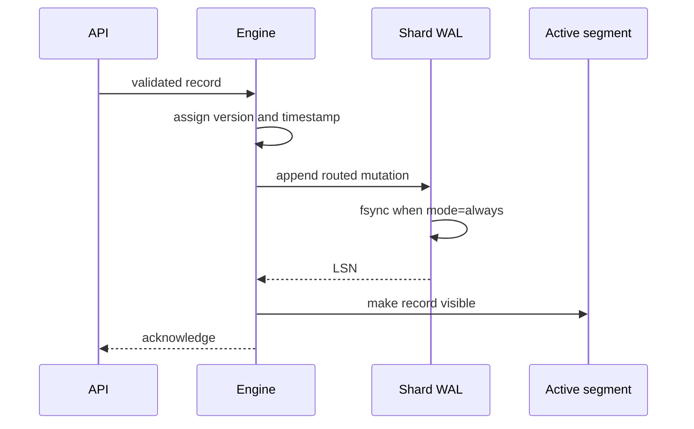

# Write-ahead log and recovery

**Maturity:** Experimental

Each logical shard owns one append-only WAL at:

```text
<data-path>/wal/<collection>/shard-<six-digit-id>.wal
```

The collection catalog contains configuration only. Upsert processing is:



Deletes first verify that the exact namespace/ID exists, then follow the same
write-ahead order. Mutations are globally serialized in the current engine;
the production segment phase will replace this with per-shard serialization.

## Durability modes

- `always` (default): every acknowledged mutation has completed a successful
  WAL file `fsync`. WAL file creation and its containing directory are synced
  when the shard log is opened. Hardware, filesystem, and storage-controller
  behavior still determine whether `fsync` survives physical failure.
- `async`: acknowledgement follows the kernel write without per-record fsync.
  Graceful close syncs the file, but a process/OS/power failure may lose
  acknowledged mutations.

`batch` is intentionally rejected rather than silently behaving like another
mode. A real group-commit coordinator with bounded delay will introduce it.

## Recovery

Startup loads the collection catalog and any legacy experimental base records,
then replays every shard WAL in LSN order. Routing is recomputed for every
mutation; a record found in the wrong shard fails startup. Replayed versions are
preserved and HNSW graphs are rebuilt deterministically.

A partial final header or payload is treated as a torn tail. Recovery keeps all
complete records and truncates the file to their boundary. Invalid magic,
version, length, operation, LSN continuity, or CRC in a complete record is
corruption and fails startup. Recovery never scans past corruption or silently
repairs it.

## Current limitations

Immutable checkpoints bound WAL growth by mutation count. There is no batch
group commit, byte/time checkpoint threshold, repair CLI, replication commit
marker, or stable compatibility promise. A checkpoint currently rewrites every
live record in a shard and therefore causes write amplification.
