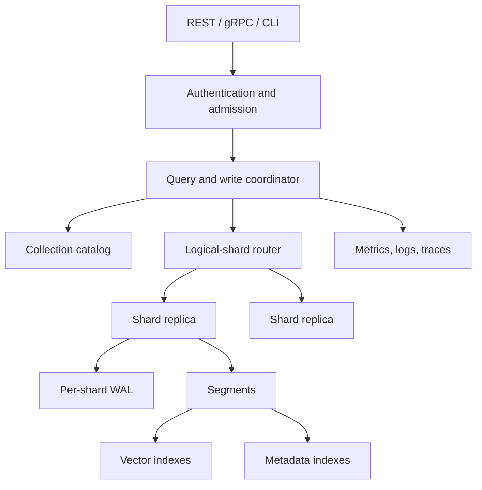
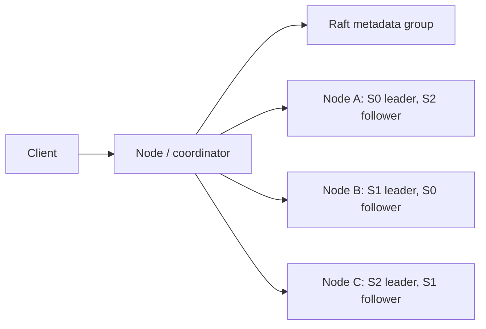
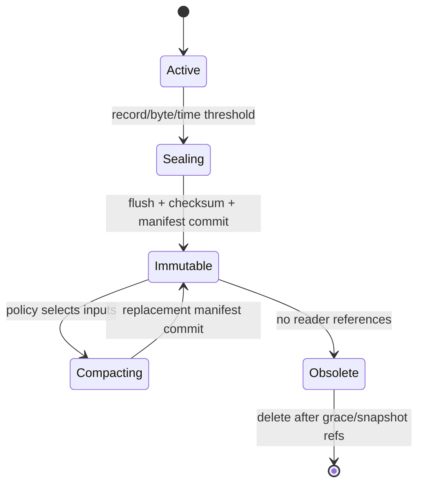

# VectorDB comprehensive technical design

**Status:** Proposed  
**Scope:** Architecture before implementation  
**Compatibility:** No public or persistent compatibility exists yet

This document is the implementation contract for the first phases. Later
distributed sections specify the intended destination and its failure model;
they are not claims of implemented behavior.

## Design principles and guarantees

Correctness, recovery, observability, and reproducible measurement precede
optimization and distribution. Every queue, worker pool, cache, fanout, retry,
and background job is bounded. The database accepts vectors; embedding
generation stays in SDK integrations.

The first release targets single-record atomicity and per-shard ordered writes.
It does not promise cross-shard transactions, linearizable replica reads,
exactly-once client delivery, or a dataset-size ceiling. Request IDs make
retries idempotent within a documented retention window.

## 1. System architecture



The control plane owns schema, membership, placement and epochs. The data
plane owns shard WALs, segments, indexes, reads, writes and replication. This
separation prevents a global metadata consensus group from serializing vector
writes.

## 2. Single-node architecture

One process hosts a catalog and all logical shards. API handlers validate and
admit requests, then route them through the same shard interface used by remote
transport later. An in-process transport avoids serialization but preserves
deadlines and cancellation. Each shard owns its WAL, active segment, immutable
segment set, compaction state and monotonically increasing LSN.

Startup opens the catalog, validates manifests, recovers each shard in a
bounded worker pool, and becomes ready only when required shards are readable.
Search can run while nonessential index warming continues.

## 3. Distributed architecture

Nodes are symmetric: any node can coordinate, while only assigned replicas
store a shard. The placement table maps `(collection, shard)` to replicas,
leader and epoch. Coordinators group writes by leader and fan search to one
eligible replica per shard. Internal gRPC carries deadlines, identity, epoch
and protocol version.



## 4. Component responsibilities

| Component | Owns | Must not own |
|---|---|---|
| Catalog | collection schemas and versions | record data |
| Router | ID-to-shard mapping, placement lookup | storage |
| Shard | ordering, WAL, segment view, idempotency | node placement |
| Segment | bounded records and local indexes | replication |
| Query engine | planning, bounded fanout, top-k merge | durability |
| Storage engine | files, manifests, checksums, snapshots | API semantics |
| Cluster manager | membership, placement, epochs | vector hot path |
| Resource manager | admission and worker budgets | query correctness |

Packages depend on narrow interfaces; persistence types do not import API or
cluster packages. Node identity is absent from on-disk segment contents.

## 5. Collection, shard and segment model

A collection fixes dimension, metric, logical-shard count and schema version.
Changing dimension or metric requires a new collection. Shard count is
immutable initially because changing it moves every ID; future resharding uses
a versioned routing map, not an in-place modulo change.

The initial route is `xxh3(canonical tenant || namespace || record ID) mod N`,
with the exact hash seed and byte encoding persisted in collection metadata.
Segments allocate dense internal ordinal IDs; external string IDs map through
a shard-local ID table. Newer `(version, LSN)` wins across segments. Searches
deduplicate by external ID and exclude visible tombstones.

## 6. Storage engine

Layout is collection/shard scoped:

```text
data/collections/<collection-id>/shards/<shard-id>/
  LOCK  CURRENT  manifests/  wal/  segments/  snapshots/
```

`CURRENT` atomically names a checksummed manifest. Files are written to a
temporary sibling, flushed, fsynced, renamed, then the directory is fsynced.
Immutable segment files separate vectors, records, ID map, metadata indexes,
vector index and checksums so optional indexes can be rebuilt independently.
Only committed formats use versioned magic numbers and little-endian integers.

## 7. WAL architecture

There is one ordered WAL per shard, split into size-bounded files. A record has
magic, format version, flags, header length, payload length, LSN, operation,
request ID, schema version, payload and CRC32C. The checksum covers header and
payload. Lengths are validated before allocation.

Durability modes are:

- `always`: acknowledge after the record and required directory metadata are
  durable locally.
- `batch`: a group-commit worker acknowledges after the batch fsync; a bounded
  maximum delay is configured.
- `async`: acknowledge after the process buffers the record; process or power
  loss may lose acknowledged writes.

WAL truncation occurs only after a manifest referencing durable segment data
has been committed and its maximum included LSN is known.

## 8. Crash recovery

Recovery locks the shard, loads the newest valid manifest reachable from
`CURRENT`, validates referenced segment headers and checksums, and replays WAL
records after the manifest LSN. A truncated final record is discarded. A
checksum error before the final tail is corruption and fails shard startup by
default; an explicit repair tool may truncate with a report and backup.
Idempotency keys and record versions prevent duplicate application.

Unreferenced complete files are quarantined for inspection; temporary files
are removable. Recovery never silently accepts a missing manifest segment.

## 9. Segment lifecycle



The active segment uses a flat index plus mutable metadata indexes. Sealing
freezes an LSN boundary and hands a snapshot to bounded background workers.
Readers use reference-counted immutable segment views. Compaction applies
newest-version semantics, removes tombstones safe under the retention floor,
rebuilds indexes, and atomically swaps the manifest.

## 10. HNSW design

HNSW implements the same `VectorIndex` contract as flat search. Parameters
`M`, `efConstruction`, and default `efSearch` are collection configuration and
stored in the index header. Search may raise `efSearch` per request within an
admission limit.

Vectors live in a contiguous `[]float32` arena indexed by ordinal. Graph levels
use packed neighbor-ID arrays with offset/length tables, avoiding per-edge
pointers. Construction uses striped node locks and a bounded build pool;
published neighbor lists are immutable snapshots for lock-light reads.
Deletion marks an ordinal and compaction rebuilds the graph. Save/load uses a
versioned checksummed file and verifies all ordinals and offsets before use.

Flat remains the correctness oracle. Benchmarks report recall@k against flat,
QPS, latency percentiles, build time, allocations and resident bytes/vector.
Portable Go kernels ship first; architecture-specific acceleration requires
benchmarks and exact numerical-tolerance tests.

## 11. Memory layout

Active vectors are contiguous row-major float32 blocks. Immutable vector files
are mmap candidates; mappings are accounted separately from Go heap. Metadata
uses column-oriented typed values, dictionary encoding for strings, validity
bitmaps and roaring-style posting bitmaps. Payload blobs stay off the search
hot path and are fetched only for final results.

Every owned buffer reports logical and resident estimates to the resource
manager. Scratch buffers come from size-class pools with maximum retained
capacity; oversized buffers are not pooled. No correctness relies on
`sync.Pool`. Float16 and quantization require separate format ADRs and recall
evidence.

## 12. Metadata filtering

Filters parse into a typed AST (`AND`, `OR`, `NOT`, comparisons, `IN`,
`EXISTS`, range). Schema-aware validation rejects incompatible comparisons.
Equality uses dictionary/posting indexes; numeric range uses sorted block
indexes plus bitmaps. Boolean set algebra produces candidate bitmaps.

The planner chooses prefilter (selective bitmap before vector search), inline
filter (HNSW traversal admits matching results but may traverse nonmatches), or
postfilter with bounded overfetch. Estimates come from segment statistics and
are checked against actual cardinality metrics. Exact semantic tests run every
operator against a scan oracle.

## 13. Query engine

Planning resolves tenant and collection schema, validates dimension, selects
shards, compiles filters, chooses segment strategies and reserves a fanout
budget. Execution searches segments concurrently within the budget, merges
local results, fetches payloads only for winners, and observes cancellation.
Plans are immutable request objects; no global query lock exists.

## 14. Local search lifecycle

The shard takes a short-lived snapshot of the active and immutable segment
view. Each segment returns bounded candidates ordered by the collection's
canonical internal score. A fixed-size max/worst heap merges results, applies
version/tombstone visibility, deduplicates IDs and returns top-k. Snapshot
references are released even on cancellation. Partial local segment failure is
an error; silently incomplete local results are forbidden.

## 15. Distributed search lifecycle

The coordinator pins a placement epoch, chooses replicas according to read
policy, and sends concurrent shard requests through a global and per-node
semaphore. Each shard returns at most `k * overfetch` candidates, capped by
configuration. The coordinator merges, deduplicates and optionally fetches
payloads.

Requests carry deadlines and cancellation. By default any missing shard fails
the request. An explicit `allow_partial=true` returns results plus missing
shards and errors; partial results are never indistinguishable from complete
ones. One bounded retry may use another replica if deadline and freshness
requirements allow.

## 16. Distributed top-k merge

All nodes expose the same normalized ordering: higher internal score is better,
then external ID provides a deterministic tie break. A size-k heap makes merge
cost `O(C log k)` for `C` received candidates and memory `O(k + shards)` plus
dedup state. Candidate multiplier is benchmark-tuned and always capped.

## 17. Distributed write lifecycle

The entry node authenticates, validates and groups a batch by logical shard.
Each group goes to the placement-epoch leader. The leader assigns LSN/version,
appends WAL, replicates in log order, waits for the requested acknowledgement,
then applies to the active view before responding. Recovery replays committed
entries. A batch is atomic only within one shard; a cross-shard response lists
each shard outcome and supports idempotent retry.

## 18. Shard routing

Modulo hashing is selected for the fixed-shard-count first release because it
is simple, deterministic and testable. Rendezvous hashing is rejected for
record routing because physical membership must not alter logical ownership.
Consistent hashing is reserved for placement, where it may assist candidate
selection but cannot replace an explicit, epoch-versioned placement table.

## 19. Replication strategy

Planned replication uses one leader per shard and ordered log shipping to
followers. `ONE` waits for the leader's configured local durability, `QUORUM`
waits for durable acknowledgement from a majority of configured replicas, and
`ALL` waits for every configured replica. Unavailable replicas cause `ALL` to
fail; membership is not shrunk implicitly.

Entries are identified by shard epoch and LSN. Followers reject stale leaders
and detect gaps. Snapshot plus incremental WAL repairs lagging replicas. This
design is not considered strongly consistent until leader election and commit
rules are implemented and partition-tested.

## 20. Consistency model

Single-node reads after a successful write on the same process observe it.
Within a shard, leader operations are ordered. Distributed leader reads target
read-your-write behavior when the client passes the returned version token.
`nearest` or `any` may be stale; `quorum` reads are deferred until a precise
version-reconciliation protocol exists. There is no global ordering across
shards and no multi-shard transaction.

## 21. Consensus strategy

A small Raft group manages collection definitions, membership, placement,
replica sets, leaders, epochs, protocol/schema compatibility and cluster
configuration. User vector writes never enter this global log. Initially,
shard replication may use metadata-elected leaders; stronger per-shard
consensus is introduced only if failure testing shows the simpler protocol
cannot meet documented guarantees.

## 22. Cluster metadata

Metadata records include cluster ID, node identity/incarnation, advertised
addresses and capabilities, collection/schema/routing versions, shard replica
sets, leader, placement epoch, desired state and migration state. Raft snapshots
and logs persist this data. Data-plane requests carrying an old epoch receive a
typed redirect/retry response, never an unconditional acceptance.

## 23. Node discovery

Seed addresses only bootstrap contact; they are not membership truth. Static
seeds ship first, then DNS and Kubernetes providers behind a discovery
interface. A durable random node ID survives address and pod changes. Duplicate
identity is rejected using incarnation and lease/election evidence.

## 24. Failure detection

Periodic heartbeats carry incarnation, last applied metadata index, resource
signals and replica progress. Phi-accrual or consecutive-threshold suspicion
separates transient delay from failure. States are healthy, suspected,
unhealthy, offline and recovering. Failure detection informs consensus; it does
not itself grant leadership.

## 25. Network partitions

Only the metadata-consensus majority may change placement or leaders. A
minority partition serves no writes requiring current leadership and may serve
explicitly stale reads only if configured. Shard leaders require valid epoch
and, for quorum writes, replica majority. Old leaders reject after lease/term
loss. Rejoining nodes enter recovering state, compare epochs, discard
uncommitted divergent tails where the replication protocol permits, and repair
before serving current reads.

## 26. Rebalancing

The planner uses replica count, failure domains, disk/RAM capacity, current
load and movement budget. Execution is an idempotent state machine recorded in
cluster metadata. Per-node and cluster-wide transfer limits prevent saturation.
Automatic removal never reduces below the desired durable replica count.

## 27. Shard migration

Destination creates a staging replica, receives a checksummed snapshot, verifies
files, replays WAL from the snapshot LSN, catches up, and becomes readable only
after leader verification. Placement changes atomically at a new epoch. The old
replica remains until the new placement is healthy and a grace period passes.
Restart resumes from persisted transfer state; it never restarts unboundedly.

## 28. Resource management

Separate weighted pools cover foreground search, writes, index builds,
compaction, replication and maintenance. Worker defaults derive from available
CPU but obey explicit caps. Admission reserves memory and concurrency before
work starts. Foreground minimum shares and background maximum shares avoid
starvation. Disk and network token buckets bound bulk work.

## 29. Backpressure

Bounded API bodies, batch sizes, queues, inflight bytes and fanout reject early
with typed retryable errors. Signals include heap/RSS, mmap pressure, WAL bytes,
replication lag, compaction debt, disk free space/latency and worker saturation.
Retries use capped exponential backoff with jitter, retry budgets and client
deadlines. A full disk stops new durable writes before reserve space is
exhausted but preserves reads and administrative recovery.

## 30. CPU concurrency model

Handlers are goroutines, but vector work is submitted as batches to bounded
pools; never one goroutine per vector. Segment and shard fanout share a request
budget. Distance kernels process contiguous batches. Hot counters are sharded
or padded after profiling confirms contention/false sharing. Race tests and
mutex/block profiles gate concurrency changes.

## 31. RAM management

The resource manager tracks Go heap, mapped virtual/resident bytes, vector and
index ownership, metadata, caches and inflight scratch. Hard admission limits
protect correctness; soft watermarks evict caches, reduce background work and
flush active segments. OS page cache is treated as observable but not fully
controllable. The engine must operate with cold immutable segments on disk,
accepting measured latency degradation rather than failing correctness.

## 32. Persistent formats

Each format specification must define magic, semantic version, flags,
endianness, alignment, lengths, limits, checksums and compatibility. Readers
reject unknown major versions and ignore only explicitly length-delimited
optional fields. Writers never overwrite committed files. Golden fixtures,
round-trip/property tests, truncated-input tests and fuzzing are required
before a format is stable. Initial exact byte layouts will be frozen in
`docs/internals/` alongside implementation, not guessed in advance.

## 33. REST API

`/v1` exposes collection CRUD, record upsert/get/delete/batch, search, health,
readiness and metrics. Cluster/snapshot endpoints appear only with their
implementation. OpenAPI is the source of request/response schemas. Errors use
stable machine codes, request ID, message, retryability and field details.
Pagination uses opaque versioned cursors. Mutations accept idempotency keys;
deadlines and maximum body/vector/batch sizes are enforced.

## 34. gRPC API

Protobuf packages are versioned (`vectordb.v1`) and every public field and RPC
is commented. Unary RPCs cover collection and record operations; streaming is
reserved for bounded batch ingestion, shard transfer and snapshots with flow
control. Status details carry the same stable error codes as REST. Buf lint and
breaking-change checks run in CI. Internal cluster services use separate
protos and mandatory mTLS in distributed production mode.

## 35. SDK architecture

Go, Python and TypeScript are first. Generated transport models remain
internal; handwritten clients provide ergonomic types, retries only for safe
idempotent calls, deadlines, async/batch APIs and consistent errors. SDKs do
not generate embeddings in the core package. Java, Rust and .NET wait until the
API stabilizes and maintainer demand exists.

## 36. Dashboard architecture

A React/TypeScript SPA consumes only public/admin versioned APIs. Sections are
overview, collections, explorer, search playground, cluster, nodes/shards,
performance, logs and configuration. SSE supplies low-frequency live status;
Prometheus remains the metrics system of record. Vectors and payloads are
redacted by default, destructive operations require explicit confirmation, and
dashboard authorization never exceeds the backing API identity.

## 37. Observability

Prometheus metrics use bounded labels (never record, tenant, request or raw
collection IDs by default). OpenTelemetry spans cross API, coordinator, shard,
WAL and replication boundaries. Structured logs include request/trace ID,
node, shard and stable error code without vectors, payloads, secrets or API
keys. Histograms cover search/write latency, WAL fsync, fanout, compaction and
replication lag. Go runtime and pprof endpoints are separately protected.

## 38. Security

The initial threat model covers unauthenticated network access, tenant-boundary
bypass, oversized inputs, malformed files, path traversal, secret leakage and
internal impersonation. API keys are hashed at rest and scoped to tenant,
namespace, collection and operation. TLS is supported at the edge; distributed
mode requires mTLS between nodes. Every lookup includes tenant in its canonical
key. Limits are checked before allocation. Advanced RBAC and audit retention
are later phases, explicitly marked unsupported until implemented.

## 39. Backup and recovery

A shard snapshot pins a manifest, flushes the WAL boundary, and exports
immutable referenced files plus checksummed metadata. Restore writes into a new
staging directory, verifies every file and collection schema, then atomically
activates it. Online backup may copy immutable files while retaining their
references. Cluster backup later records a consensus barrier and per-shard LSN;
until then, independent shard snapshots are not transactionally consistent.

## 40. Kubernetes deployment

StatefulSets provide stable identities; one persistent volume stores each
node's data. Headless and client Services separate discovery and traffic.
ConfigMaps hold nonsecrets, Secrets hold credentials/certificates, and a
PodDisruptionBudget protects metadata quorum. Startup probes cover recovery,
readiness requires current metadata and assigned shard readiness, and liveness
only detects deadlock—not slow recovery. Graceful termination drains requests
and leadership. Anti-affinity spreads replicas across failure domains.

## 41. Repository structure

Use `cmd/vectordb`, `internal/{api,engine,collection,shard,segment,storage,wal,
index,metadata,query,cluster,resource,metrics,security,config}`, `proto`, `pkg/
client`, `sdk`, `dashboard`, `benchmarks`, `deployments`, `examples`, `tests`
and `docs`. Improvements over the proposed tree are:

- add `internal/resource` for admission and budgets rather than hiding them in
  memory utilities;
- separate public and internal protobuf APIs;
- keep format codecs under their owning storage/index package to prevent a
  generic dumping ground;
- organize tests near code first, with `tests/` only for black-box integration,
  recovery, distributed and chaos suites;
- avoid empty SDK/package scaffolding until ownership and CI exist.

Go `internal` boundaries prevent accidental public APIs. Import-cycle checks
and dependency rules keep storage independent of transport and clustering.

## 42. Documentation structure

`docs/README.md` is the index. Architecture, storage, distributed behavior,
indexing, APIs, operations, security, benchmarks, development, formats and
ADRs gain focused documents with their implementing phase. Mermaid sources are
reviewable text. CI checks links, Markdown, OpenAPI, protobuf docs, required
format documents and executable examples. Maturity labels prevent plans from
appearing implemented.

## 43. ADR strategy

Cross-component choices, persistent/public compatibility, guarantees or hard-
to-reverse dependencies require ADRs. ADRs are immutable once accepted except
for status and clarifications; a new ADR supersedes an old one. Each records
context, decision, alternatives, advantages, disadvantages, performance,
failure and future consequences.

## 44. Testing strategy

Unit tests cover metrics, routing, heaps, parsers and state machines. Property
tests compare indexes/filters with scan oracles and validate manifest/WAL
invariants. Integration tests exercise public APIs and real disks. Recovery
tests crash at every fsync/rename boundary. Corruption tests flip/truncate bytes.
Fuzzers target codecs, filters, APIs and protobuf/REST boundaries. `go test
-race ./...` is a CI gate. Compatibility fixtures protect formats and APIs.

## 45. Chaos testing

Deterministic fault injection wraps filesystem, clock, network and process
boundaries. Scenarios include leader/replica/coordinator kill, partitions,
delay/loss, slow/full disk, corrupted WAL/segment, join/leave, lag and migration
restart. A reference history checker validates acknowledged-write guarantees,
monotonic leader reads and explicit partial failures. Seeds and event timelines
are retained for reproduction.

## 46. Benchmark methodology

Benchmarks have a checked-in workload manifest, dataset checksum, warmup,
steady-state duration, repeated runs and raw result artifacts. The matrix covers
dimensions 128/384/768/1536/3072, sizes the available hardware can honestly
run, concurrency 1/8/32/64/128/256 and k 1/10/50/100. ANN reports recall against
flat. Results include CPU model/count, RAM, disk/filesystem, OS/Go version,
commit, index settings, durability, cache state, QPS, p50/p95/p99, allocations,
RSS, disk/network bytes and error rate. Competitor comparisons use equivalent
hardware, recall, durability and client behavior.

## 47. Profiling strategy

Every optimization begins with a saved benchmark and CPU/heap evidence.
Profiles include CPU, heap/allocation, mutex, block, goroutine and execution
trace. Search, ingest, build, recovery and compaction are profiled separately.
Performance PRs attach before/after raw results, profiles, recall/correctness
checks and variance; regressions remain visible in continuous benchmarks.

## 48. Open-source workflow

Apache-2.0 is preferred for explicit patent protection. Required project files
are license, contribution guide, code of conduct, security policy, changelog,
roadmap, issue/PR templates and DCO or CLA policy. CI runs formatting, vet,
lint, unit/race/integration tests, fuzz smoke tests, docs/link checks, protobuf/
OpenAPI compatibility and build reproducibility. Maintainer review is required
for formats, APIs, unsafe code, dependencies and guarantees. Releases use
semantic versioning; pre-1.0 incompatibilities require migration notes.

## 49. Implementation roadmap

The [roadmap](roadmap.md) sequences foundations, HNSW, durable storage,
production single-node operation, clustering, replication, rebalancing,
hardening and ecosystem work. A phase cannot close with failing recovery tests,
unbounded resources, undocumented formats or unreported benchmark settings.

## 50. First usable release (v0.1.0)

Included: Go server; collection/logical-shard/segment hierarchy; float32 and
cosine/dot/L2; flat and HNSW; WAL with documented durability; recovery;
immutable segments and bounded compaction; tombstones; indexed metadata
filters; REST and gRPC; CLI; Prometheus metrics and structured logs; snapshots;
Docker image; Go client; reproducible correctness, recall and performance
benchmarks; complete documentation for implemented behavior.

Excluded: distributed execution/consensus/replication, automatic rebalancing,
advanced quantization, sparse/hybrid search, advanced RBAC, Kubernetes operator,
dashboard and six SDKs. Logical shards and transport interfaces are included so
these additions do not change the storage ownership model.

Release gates are: clean normal and race test suites; crash/corruption matrix;
format fixtures; OpenAPI/protobuf compatibility checks; bounded-resource load
test; backup/restore drill; security review; and published benchmark artifacts
with no unsupported scale claim.

## Decision summary

The central trade-off is deliberate: fixed logical shards and immutable
segments add machinery to a single-node database, but isolate concurrency,
recovery, compaction and future placement. Per-shard WALs complicate global
ordering, but avoid a global write bottleneck. Metadata Raft gives coherent
placement without sending vector traffic through one consensus group. Packed
HNSW and mmap-oriented immutable files reduce pointer/GC cost, at the price of
more explicit format validation. These decisions fail closed on corruption and
stale epochs, favoring acknowledged-data safety over availability.
